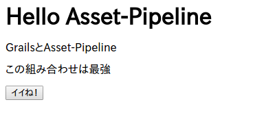
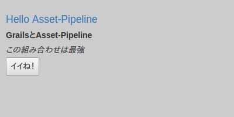
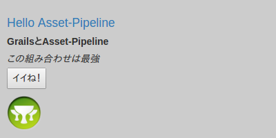
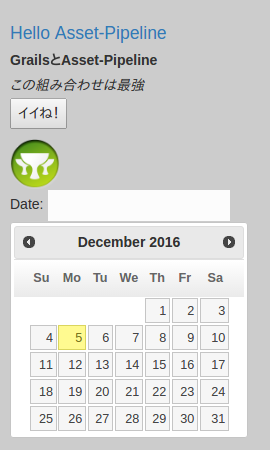

# Asset Pipeline

G*Advent Calendar(Groovy,Grails,Gradle,Spock...) Advent Calendar 2016 6日目の記事です。  
前日 -> [@h1romas4さん](http://qiita.com/h1romas4)  
翌日 -> [私です。GrailsでのES6とSCSSについて書きます](additional.html)  

## 概要

Grails2.4から、JavaScriptやCSS、画像といったいわゆる静的なファイルは、 **Asset Pipeline** というプラグインを経由して利用するようになりました。  
大雑把にこのAsset-Pipelineのメリットをまとめると、  

1. JavaScriptがさらに別のJavaScriptを読み込めるので、JavaScriptが追加になっても、GSPには手を加えなくてもOK。
2. CSSがさらに別のCSSを読み込めるので、CSSが追加になっても、GSPには手を加えなくてもOK。
3. Grailsアプリケーションのリリース時に、warやjarに固めた時点で、デフォルトで全て一つのJSファイル、CSSファイルにminifyしてくれる。
4. minifyする際にはファイル名にフィンガープリントが割り当てられるため、Webサーバなどでキャッシュを有効にさせていてもファイルの更新に問題がでない。

というようなメリットが挙げられます。  
開発時点では、 **共通のJavaScript、CSSファイルをそれぞれ用意しておき、それ以外のJavaScript/CSSファイルはそれぞれその共通のファイルから読み込む** ようにしておけば、アプリケーションに大量に存在しているであろうGSPファイルに態々`<script type="text/javascript" src="hoge.js"></script>`や、`<link rel="stylesheet" type="text/css" href="piyo.css">`を毎回追加する必要がなくなります。これは非常に楽ですね！  
本番環境でのメリットも当然有って、minfyされるわけですので **クライアントへの応答時間の高速化** 、さらに **安心してブラウザにキャッシュ** させることができます。  

### 設置場所
特に難しいことは何もありせん。JavaScriptもCSSも画像も、全部普通のものです。  
それらを決まったディレクトリに配置してあげます。  

|種類|設置場所|
|---|---|
|JavaScript|`grails-app/assets/javascripts/`|
|CSS|`grails-app/assets/stylesheets/`|
|画像|`grails-app/assets/images/`|

つまり、GrailsでのWebアプリケーション開発ではJavaScript、CSS、画像は基本的に全てこの`grails-app/assets/`の下に置くことになります。  

実際にGrails (3.2.3) で新規にアプリケーションを作成した場合の`grails-app/assets`を見てみると以下のようになっています。  

```
assets
├── images
│   ├── apple-touch-icon-retina.png
│   ├── apple-touch-icon.png
│   ├── favicon.ico
│   ├── grails-cupsonly-logo-white.svg
│   ├── skin
│   │   ├── database_add.png
│   │   ├── database_delete.png
│   │   ├── database_edit.png
│   │   ├── database_save.png
│   │   ├── database_table.png
│   │   ├── exclamation.png
│   │   ├── house.png
│   │   ├── information.png
│   │   ├── shadow.jpg
│   │   ├── sorted_asc.gif
│   │   └── sorted_desc.gif
│   └── spinner.gif
├── javascripts
│   ├── application.js
│   ├── bootstrap.js
│   └── jquery-2.2.0.min.js
└── stylesheets
    ├── application.css
    ├── bootstrap.css
    ├── errors.css
    ├── grails.css
    ├── main.css
    └── mobile.css

4 directories, 25 files
```

ちゃんとそれぞれのディレクトリにファイルが分けられて設置されいますね。  

### 利用方法

まず、`grails-app/assets/javascripts/application.js`（JavaScript）の中身を見てみます。  

```javascript
// This is a manifest file that'll be compiled into application.js.
//
// Any JavaScript file within this directory can be referenced here using a relative path.
//
// You're free to add application-wide JavaScript to this file, but it's generally better
// to create separate JavaScript files as needed.
//
//= require jquery-2.2.0.min
//= require bootstrap
//= require_tree .
//= require_self
if (typeof jQuery !== 'undefined') {
    (function($) {
        $(document).ajaxStart(function() {
            $('#spinner').fadeIn();
        }).ajaxStop(function() {
            $('#spinner').fadeOut();
        });
    })(jQuery);
}
```

次に`grails-app/assets/stylesheets/application.css`（CSS)を見てみます。  

```css
/*
* This is a manifest file that'll be compiled into application.css, which will include all the files
* listed below.
*
* Any CSS file within this directory can be referenced here using a relative path.
*
* You're free to add application-wide styles to this file and they'll appear at the top of the
* compiled file, but it's generally better to create a new file per style scope.
*
*= require bootstrap
*= require grails
*= require main
*= require mobile
*= require_self
*/
```

両方ただのJavaScriptとCSSファイルですね。  

ココで１点注目なのが、それぞれのファイルのコメントです。  
JavaScriptだと  

```javascript
//=
```
で始まっている部分、  
CSSだと  

```css
*=
```
で始まっている部分です。  

実はこの部分は特殊なコメントで、 **ディレクティブ** と呼ばれる部分です。  
このディレクティブを使うことで、このファイルに、ディレクティブに指定したJavaScript/CSSを読み込むことが出来ます。  
ディレクティブの書き方はJavaScript、CSS共通で、以下の種類の物があります。  

|ディレクティブ |意味 |
|--|--|
|require | 相対パスで指定したJavaScript/CSSファイルを読み込む|
|require_tree |相対パスでディレクトリを指定する。するとその配下のJavaScript/CSSファイルを全て読み込んでくれる。 |
|require_self |自分自身のファイル。|
|encoding | 文字コード


`require`に指定するJavaScriptやCSSファイルは、拡張子を指定しなくてもOKです。（指定してもOK）  

つまり、`application.js`の場合、`jquery-2.2.0.min.js`、`bootstrap.js`を、  
`application.css`の場合`bootstrap.css`、`grails.css`、`main.csss`、`mobile.css`  
をそれぞれ読み込むようになっています。  

そしてこれらのファイルを利用するには、GSPファイルで以下のように指定します。  

```html
<head>
    <asset:stylesheet src="application.css" />
    <asset:javascript src="application.js" />
    <title>Hello</title>
</head>
```

このように記述するだけで、そのGSPファイルには自動的に上記で記した複数のJavaScriptファイルとCSSファイルが読み込まれるようになります。  

ちなみに、ディレクティブのうち`require_self`が少しわかりにくいですね。  
これは、自分自身を表すディレクティブ、つまり今回の場合だと`application.js`と`application.css`になります。  
この`require_self`を利用することで、自分自身が読み込まれる（HTML上で現れる）順番を制御することが出来ます。  

つまり、  

```javascript
//= hoge
//= require_self
```
の場合、HTML的には  

```html
<script type="text/javascript" src="/assets/hoge.js?compile=false" ></script>
<script type="text/javascript" src="/assets/application.js?compile=false" ></script>
```
という順番で読み込まれ、  

```javascript
//= require_self
//= hoge
```
の場合、HTML的には  

```html
<script type="text/javascript" src="/assets/application.js?compile=false" ></script>
<script type="text/javascript" src="/assets/hoge.js?compile=false" ></script>```
```
となります。CSSでも同じ動作です。
JavaScriptで関数が先に宣言されている必要がある場合など、読み込まれる順番を制御したい場合に利用します。  

## チュートリアル
まず、以下のようなGSPを用意します。  

```html
<html>
<head>
    <title>Hello</title>
</head>
<body>
<h1>Hello Asset-Pipeline</h1>
<div class="content">
    <p class="title">GrailsとAsset-Pipeline</p>
    <p class="description">この組み合わせは最強</p>
</div>
<button id="like-button">イイね！</button>
</body>
</html>
```

この状態でGSPにアクセスすると以下のようになります。  



普通ですね。  
では、実際にAsset-pipelineを操作してみましょう！  

### JavaScript

#### 基本

画面上に **イイね！**ボタンがありますが、まだ押しても何も起きません。  
このボタンに動作を追加してみます。

`grails-app/assets/javascripts/application.js`というファイルを以下のように修正します。  

```javascript
// This is a manifest file that'll be compiled into application.js.
//
// Any JavaScript file within this directory can be referenced here using a relative path.
//
// You're free to add application-wide JavaScript to this file, but it's generally better
// to create separate JavaScript files as needed.
//
//= require jquery-2.2.0.min
//= require bootstrap
//= require_tree .
//= require_self

if (typeof jQuery !== 'undefined') {
    (function($) {
        $(document).ajaxStart(function() {
            $('#spinner').fadeIn();
        }).ajaxStop(function() {
            $('#spinner').fadeOut();
        });
    })(jQuery);
}

// -------------------------------------------
// 以下を追加
// -------------------------------------------
$(function(){
    $('#like-button').click(function(){
        alert("Grails良いよね！！")
    });
});
```

そして、GSPのheadタグの中に  

```html
<asset:javascript src="application.js" />
```
を追加して、このJavaScriptファイルをAsset Pipeline経由で読み込みます。  

これで、ページを更新して、 **イイね！** をクリックするとポップアップが表示されるようになりました。  
ちゃんとAsset Pipeline経由でJavaScriptが利用できましたね！  

ただ、このままだとこの`application.js`がどんどん肥大化していってしまいますよね。  
当然Asset Pipeline経由でもちゃんとサブディレクトリなどを作ってJavaScriptを整理することが出来ます。  

#### サブディレクトリの作成とJavaScriptファイルの分割
では、`grails-app/assets/javascripts/`の中に、`my-js`というディレクトリを作り、`my-original.js`というJavaScriptファイルを作成します。  
その中に先ほど`application.js`に追記した処理を移します。  

`grails-app/assets/javascripts/my-js/my-original.js`

```javascript
$(function(){
    $('#like-button').click(function(){
        alert("Grails良いよね！！(移動したよ)")
    });
});
```

では、再度画面をリフレッシュして **イイね！** ボタンをクリックしてみてください。  
ちゃんと今回作成したJavaScriptが実行されていることが解ると思います。  

#### 詳細
ここで一つ疑問があります。それは、  

**application.jsはもちろん、GSPにも先ほど追加したmy-js/my-original.jsについて記述していないのに、なぜそのJavaScriptファイルが有効になったのか？**  
という点です。  
これは何故かというと、`application.js`には`//= require_tree .`と記述されれているので、`application.js`と **同じディレクトリにあるJavaScriptファイルを、再帰的に全て自動で読み込んでくれるようになっているため** です。  
つまり、今回追加した`my-js/my-original.js`も、ちゃんと仕様通り`application.js`から読み込まれているわけですね。  
当然`require_tree`の代わりに`require`を使って全てのJavaScriptを指定することも出来ます。  
少し面倒にはなりますが、`require`を使うことで読み込むJavaScriptファイルの順番を制御することが出来ます。  

ではさらにテストとして、以下のようにディレクトリをJavaScriptファイルを用意します。  

```bash
assets/javascripts/my-js
├── hoge
│   ├── hoge1.js
│   ├── hoge2.js
│   └── piyo
│       └── hoge-piyo.js
└── my-original.js
```


各JavaScriptファイルは単純にそのJavaScriptファイル名を出力する`console.log("This is hoge1.js");`のような記述しています。  
（`my-original.js`にも末尾に追加してください）  

できたら、さっそく画面をリフレッシュしてください。  
console.logを使っていますので、JavaScriptのデバッグコンソールなどで結果を確認すると、  

```
This is hoge1.js
This is hoge2.js
This is hoge-piyo.js
This is my-original.js
```

と出力されます。  
なんと！`application.js`もGSPも全くいじってないのに、これだけ大量のJavaScriptファイルが簡単に読み込めました！  

このように、 **Asset Pipelineを利用することで、簡単かつ一元的にJavaScriptを管理することが出来るようになり、本番環境へデプロイする際にはminify&ユニークなファイル名に自動的にリネームしてくれます。**  


###CSS

では、CSSの方も試していきましょう。  

`grails-app/assets/stylesheets/application.css`というファイルの中身を、以下のように修正します。  

```css
/*
* This is a manifest file that'll be compiled into application.css, which will include all the files
* listed below.
*
* Any CSS file within this directory can be referenced here using a relative path.
*
* You're free to add application-wide styles to this file and they'll appear at the top of the
* compiled file, but it's generally better to create a new file per style scope.
*
*= require bootstrap
*= require grails
*= require main
*= require mobile
*= require_self
*/

/****** 以下を追加 ******/
body {
    padding:10px;
    background-color: #cccccc;
}
h1 {
    color: #337ab7;
}

.content .title {
    font-weight: bold;
}
.content .description {
    font-style: italic;
}
```

そして、GSPのheadタグの先頭に  

```html
<asset:stylesheet src="application.css" />
```
を追加します。  

JavaScriptの場合とほとんど同じですね！  
違うところといえば、`application.css`で指定するディレクティブが`*= ディレククティブ名`になっているところだけですね。  
つまりは普通の`コメント= ディレクティブ名 ファイルのパス`というフォーマットになっているということですね。  

さて、これで画面をリフレッシュするとGSPにアクセスすると、以下のようにちゃんとCSSが反映されています。  



JavaScript同様ちゃんと記述したCSSが反映されていることが分かります。  
CSSの場合も、JavaScriptの場合と同じ方法でサブディレクトリを作成して読み込むことが出来ます。  

####サブディレクトリの作成とCSSファイルの分割
JavaScriptの場合と全く同じです。  
なので、こちらも`grails-app/assets/stylesheets/my-css/my-original.css`という新しいファイルを作成して、先ほど`application.css`に追加したCSSを移動させます。  

`grails-app/assets/stylesheets/my-css/my-original.css`

```css
body {
    padding:10px;
    background-color: #cccccc;
}
h1 {
    color: #337ab7;
}

.content .title {
    font-weight: bold;
}
.content .description {
    font-style: italic;
}
```

`grails-app/assets/stylesheets/application.css`に、追加したCSSの削除と、作成した上記のCSSファイルの読み込を追加します。  

```css
/*
* This is a manifest file that'll be compiled into application.css, which will include all the files
* listed below.
*
* Any CSS file within this directory can be referenced here using a relative path.
*
* You're free to add application-wide styles to this file and they'll appear at the top of the
* compiled file, but it's generally better to create a new file per style scope.
*
*= require bootstrap
*= require grails
*= require main
*= require mobile
*= require_self
*= require my-css/my-original
*/
```

`*= require my-css/my-original`が読み込み部分です。  
では、これで画面をリフレッシュしてみてください。問題なくちゃんとCSSが反映されたままになっていることが確認できます。  

その他の`require_tree`などのディレクティブの使い方や動作も、JavaScriptの場合と全く同じです。  
ディレクティブに指定するCSSなどは、全て **assets/stylesheetsディレクトリを起点とした相対パス** になります。  

余談ですが、デフォルトで用意されている`application.css`には、`application.js`と違って`require_tree .`が指定されていないので、このように自分で読み込むCSSを追加してあげる必要があります。  
当然`require_tree .`を追加するのでもOKです！  

全てのHTML/GSPファイルで、`application.css`の用な共通のCSSを一つ読み込むようにしておけば、その共通のCSSに新しいCSSやCSSファイルを追加するだけで、全てのHTML/GSPにそれが反映されます。  
このように、 **Asset Pipelineを利用することで、簡単かつ一元的にCSSを管理することが出来るようになり、本番環境へデプロイする際にはminify&ユニークなファイル名に自動的にリネームしてくれます。**  

### 画像

画像ファイルについてもAsset Pipelineで管理できます。  
ただ、画像の場合はJavaScriptやCSSの様に、マニフェストファイルが存在しません。  

単純に`grails-app/assets/images`ディレクトリの下に画像を設置するだけです。  
そしてGSPから`<asset:image src="..." />`というタグで読み込むようにします。この際に指定するパスも、JavaScriptやCSS同様に、`assets/images`からの相対パスになります。  


実際に画像を表示してみましょう。  
GSPを以下のようにします。  

```html
<html>
<head>
    <asset:stylesheet src="application.css" />
    <asset:javascript src="application.js" />
    <title>Hello</title>
</head>
<body>
<h1>Hello Asset-Pipeline</h1>
<div class="content">
    <p class="title">GrailsとAsset-Pipeline</p>
    <p class="description">この組み合わせは最強</p>
</div>
<button id="like-button">イイね！</button>

<!-- これを追加 -->
<asset:image src="apple-touch-icon-retina.png" class="img-size"/>

</body>
</html>
```
ついでなので、CSSで少しだけ画像の表示位置を調整します。  

`assets/stylesheets/my-css/my-original.css`

```css
body {
    padding:10px;
    background-color: #cccccc;
}
h1 {
    color: #337ab7;
}

.content .title {
    font-weight: bold;
}
.content .description {
    font-style: italic;
}

/* 画像表示位置の微調整用に以下を追加！ */
.img-size {
    display:block;
    margin-top: 10px;
    width:50px;
}
```

では、画面をリフレッシュしてみてください。最終的に以下のようになります。  



もし、`assets/images/hoge/piyo/test.jpg`といったサブディレクトリになっている場合も、別に特別なことはなく、  

```
<asset:image src="hoge/piyo/test.jpg" class="img-size"/>
```
と指定すればOKです。  


## 外部ライブラリの利用

例えば、ｊQuery-UIなどのJavaScriptやCSSライブラリ、そしてそれらが一緒になっている外部ライブラリを利用する方法を確認します。  
この場合は、特にルールは無いようですが、`assets`ディレクトリ配下に`vendor`というようなディレクトリを作成して、その中に外部ライブラリを配置して、`application.js`や`application.css`から必要なファイルを読み込むようにすれば動作します。  
例えば、最新版のｊQuery-UIをダウンロードしてきて、`grails-app/assets/vendor/jquery-ui-1.12.1`に設置します。  

```
assets
├── images
│     ...省略
├── javascripts
│     ...省略
├── stylesheets
│     ...省略
└── vendor <----このディレクトリを自分で作成した。別にvendorという名前じゃなくてもOK
    └── jquery-ui-1.12.1 <----ダウンロードしてきたjQuery-UIを解凍してそのままこのに設置しただけ
        ├── AUTHORS.txt
        ├── LICENSE.txt
        ├── external
        │   └── jquery
        │       └── jquery.js
        ├── images
        │   ├── ui-icons_444444_256x240.png
        │   ├── ui-icons_555555_256x240.png
        │   ├── ui-icons_777620_256x240.png
        │   ├── ui-icons_777777_256x240.png
        │   ├── ui-icons_cc0000_256x240.png
        │   └── ui-icons_ffffff_256x240.png
        ├── index.html
        ├── jquery-ui.css
        ├── jquery-ui.js
        ├── jquery-ui.min.css
        ├── jquery-ui.min.js
        ├── jquery-ui.structure.css
        ├── jquery-ui.structure.min.css
        ├── jquery-ui.theme.css
        ├── jquery-ui.theme.min.css
        └── package.json
```

そして、`application.js`では

```
//= require jquery-ui-1.12.1/jquery-ui.js
```
を、`applicaton.css`では

```
*= require jquery-ui-1.12.1/jquery-ui.css
```
という感じで、 **vendorディレクトリを省いた状態でパスを指定する** ことで、外部ライブラリ（今回の例だとjQuery-UI）が利用できる状態になります。  
自分で追加した今回のvendorディレクトリに限らず、Asset Pipelineでは、 **/assets直下のディレクトリは取り除かれます。**  
つまり、`assets/javascripts/a.js`と、`assets/stylesheets/a.css`、`asets/vendor/MyDirectory`は **全て同じディレクトリに展開されることになります。**  
これは、その性質を利用したワークアラウンドになります。  

では、追加したｊQuery-UIを利用して、DatePickerを利用してみます。  

```html
<html>
<head>
    <asset:stylesheet src="application.css" />
    <asset:javascript src="application.js" />
    <title>Hello</title>
</head>
<body>
<h1>Hello Asset-Pipeline</h1>
<div class="content">
    <p class="title">GrailsとAsset-Pipeline</p>
    <p class="description">この組み合わせは最強</p>
</div>
<button id="like-button">イイね！</button>


<asset:image src="apple-touch-icon-retina.png" class="img-size"/>
<!-- これを追加（DatePicker） -->
<p>Date: <input type="text" id="datepicker"></p>
</body>
</html>
```

1行`<p>Date: <input type="text" id="datepicker"></p>`を追加したのみですね。  
それでは、JavaScript側でこのテキストエリアがクリックされた際の挙動（DatePickerの表示）を追加します。  
今回は`grails-app/assets/javascripts/my-js/my-original.js`に追加します。  

```javascript
$(function(){
    $('#like-button').click(function(){
        alert("Grails良いよね！！(移動したよ)")
    });

    // これを追加。
    // これでテキストエリアをクリックするとカレンダーがポップアップされるようになる。
    $(function(){
        $( "#datepicker" ).datepicker();
    });
});

console.log("This is my-original.js");
```

これでOKです！実際に画面をリフレッシュしてテキストエリアをクリックすると、DatePickerが表示されます。  



このように、Asset Pipelineが標準で用意しているディレクトリの他に、外部のライブラリのディレクトリをそのまま利用することも可能です。  

## まとめ

今回のチュートリアルを通して作成されたGSPは以下のようになっています。  

```html
<html>
<head>
<asset:stylesheet src="application.css" />
<asset:javascript src="application.js" />
<title>Hello</title>
</head>
<body>
<h1>Hello Asset-Pipeline</h1>
<div class="content">
    <p class="title">GrailsとAsset-Pipeline</p>
    <p class="description">この組み合わせは最強</p>
</div>
<button id="like-button">イイね！</button>

<!-- これを追加 -->
<asset:image src="apple-touch-icon-retina.png" class="img-size"/>
<p>Date: <input type="text" id="datepicker"></p>
</body>
</html>
```

そして、上記のGSPからブラウザに返されたHTMLは以下のようになっています。  

```html
<html>
<head>
<link rel="stylesheet" href="/assets/bootstrap.css?compile=false" />
<link rel="stylesheet" href="/assets/grails.css?compile=false" />
<link rel="stylesheet" href="/assets/main.css?compile=false" />
<link rel="stylesheet" href="/assets/mobile.css?compile=false" />
<link rel="stylesheet" href="/assets/application.css?compile=false" />
<link rel="stylesheet" href="/assets/my-css/my-original.css?compile=false" />
<link rel="stylesheet" href="/assets/jquery-ui-1.12.1/jquery-ui.css?compile=false" />

<script type="text/javascript" src="/assets/jquery-2.2.0.min.js?compile=false" ></script>
<script type="text/javascript" src="/assets/bootstrap.js?compile=false" ></script>
<script type="text/javascript" src="/assets/application.js?compile=false" ></script>
<script type="text/javascript" src="/assets/my-js/hoge/hoge1.js?compile=false" ></script>
<script type="text/javascript" src="/assets/my-js/hoge/hoge2.js?compile=false" ></script>
<script type="text/javascript" src="/assets/my-js/hoge/piyo/hoge-piyo.js?compile=false" ></script>
<script type="text/javascript" src="/assets/my-js/my-original.js?compile=false" ></script>
<script type="text/javascript" src="/assets/sample.js?compile=false" ></script>
<script type="text/javascript" src="/assets/jquery-ui-1.12.1/jquery-ui.js?compile=false" ></script>

<title>Hello</title>
</head>
<body>
<h1>Hello Asset-Pipeline</h1>
<div class="content">
    <p class="title">GrailsとAsset-Pipeline</p>
    <p class="description">この組み合わせは最強</p>
</div>
<button id="like-button">イイね！</button>

<!-- これを追加 -->

<p>Date: <input type="text" id="datepicker"></p>
</body>
</html>
```

JavaScriptやCSSが大量に読み込まれていますね。  
Asset Pipelineを利用することで、例えばこれらのファイルの内１つのファイル名をリネームした場合は、全てのHTML/GSPファイルをチェックして書き換えて。。。という手間を省くことが出来るようになります。


## 参考
[Grailsポータル上のプラグイン情報](http://plugins.grails.org/plugin/asset-pipeline-grails)  
[Github](https://github.com/bertramdev/asset-pipeline)