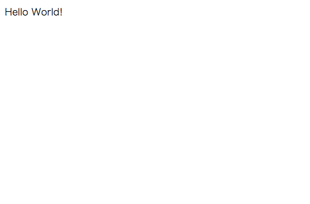

# コントローラの作成
MVCでいうのC(コントローラ)です。  
さて、それでは実際に画面に"Hello World"を表示してみましょう！  
コマンドプロンプト上で、アプリケーションホームに移動して、`grails`コマンドを実行して、インタラクティブモードに入りましょう。  
そうすると、以下のような状態になるはずです。  

```console
grails>
```

この状態で、以下のコマンドを実行してください。  

```console
create-controller hello
```
実行すると以下のようなメッセージが表示されます。

```console
grails> create-controller hello
| Created grails-app/controllers/hello_grails/HelloController.groovy
| Created src/test/groovy/hello_grails/HelloControllerSpec.groovy
grails>
```

`create-controller コントローラ名`を実行することで、コントローラと、そのコントローラのためのテストファイルが作成されます。  
では、作成された`grails-app/controllers/hello_grails/HelloController.groovy`をテキストエディタで開いてみましょう。  
（なお、このように作成されたファイルはアプリケーションホームからの相対パスになります。）  


```groovy
package hello_grails

class HelloController {

    def index() { }
}
```

上記のコードが標準で存在していると思います。  
では、以下のように`index()`の中身を書き換えましょう。  

```groovy
package hello_grails

class HelloController {

    def index() {
        render "Hello World!"
    }
}
```

続いて、Grailsを起動しましょう。  
コマンドプロンプトで以下のコマンドを実行してください。（注意：インタラクティブモードで実行してください）  

```
run-app
```

Grailsが起動したら、[http://localhost:8080/hello/index](http://localhost:8080/hello/index)にアクセスしてみましょう。  
どうでしょう。ちゃんと以下のようにHelloWorldが見えていれば成功です！  



さて、それではその状態で表示している文字列を修正してみましょう。  

```groovy
package hello_grails

class HelloController {

    def index() {
        render "こんにちわ世界！"
    }
}
```

それでは、先ほどの画面を何度かリフレッシュしてみてください。  
修正内容が自動的にGrailsによって感知され、反映されるはずです。  


反映されましたね！  
今回はコントローラの基本的な使い方を見てみました。  
ただ、実際に綺麗なデザインなどで画面を表示したい場合にはビューでHTMLやCSS、JavaScriptを扱う必要があります。  
それでは、次ページでビューを使ってHelloWorldを表示するようにしてみましょう！