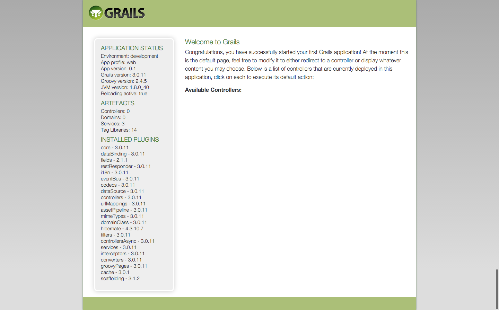

# Grailsアプリケーションの作成

さて、まずはGrailsアプリケーションを作成していきます。  
前提条件： JDK8、Grails3.0.11がインストールされていること。  
また、Grailsは基本的にコマンドラインを使って様々なコマンドを実行していきます。  
コマンドラインに慣れていない方は少し戸惑うかもしれませんが、慣れてしまえばどうということはありません。  
頑張って進めていきましょう！

##  アプリケーションを作成
Grailsのアプリケーションを作成するには、`grails create-app アプリケーション名`を実行します。  
そのコマンドを実行したディレクトリに、指定した`アプリケーション名`のディレクトリが作成され、その中にGrailsのすべてのファイルが格納されています。  
それでは早速Grailsアプリケーションを作成しましょう！  
今回は`hello_grails`というアプリケーション名にしましょう。  

`grails create-app hello_grails`

コマンドを実行すると、

```
| Application created at /Users/koji/IdeaProjects/hello_grails
```
と表示されます。  
では`hello_grails`ディレクトリの中に移動しましょう！

```console
[koji:IdeaProjects]$ cd hello_grails/
```

以降、この`hello_grails`を`アプリケーションホーム`と記述してきます。  
なお、私のこのテスト環境では、このアプリケーションホームのフルパスは`/Users/koji/IdeaProjects/hello_grails`となっています。  
もしこのチュートリアル内で`アプリケーションホーム/hoge.txt`のような記述があった場合、`/Users/koji/IdeaProjects/hello_grails/hoge.txt`と同等です。


さて、アプリケーションホームの中身は現在、デフォルト状態で以下のようになっています。  

```console
├── build.gradle
├── gradle
│   └── wrapper
│       ├── gradle-wrapper.jar
│       └── gradle-wrapper.properties
├── gradle.properties
├── gradlew
├── gradlew.bat
├── grails-app
│   ├── assets
│   │   ├── images
│   │   │   ├── apple-touch-icon-retina.png
│   │   │   ├── apple-touch-icon.png
│   │   │   ├── favicon.ico
│   │   │   ├── grails_logo.png
│   │   │   ├── skin
│   │   │   │   ├── database_add.png
│   │   │   │   ├── database_delete.png
│   │   │   │   ├── database_edit.png
│   │   │   │   ├── database_save.png
│   │   │   │   ├── database_table.png
│   │   │   │   ├── exclamation.png
│   │   │   │   ├── house.png
│   │   │   │   ├── information.png
│   │   │   │   ├── shadow.jpg
│   │   │   │   ├── sorted_asc.gif
│   │   │   │   └── sorted_desc.gif
│   │   │   └── spinner.gif
│   │   ├── javascripts
│   │   │   ├── application.js
│   │   │   └── jquery-2.1.3.js
│   │   └── stylesheets
│   │       ├── application.css
│   │       ├── errors.css
│   │       ├── main.css
│   │       └── mobile.css
│   ├── conf
│   │   ├── application.yml
│   │   ├── logback.groovy
│   │   └── spring
│   │       └── resources.groovy
│   ├── controllers
│   │   └── UrlMappings.groovy
│   ├── domain
│   ├── i18n
│   │   ├── messages.properties
│   │   ├── messages_cs_CZ.properties
│   │   ├── messages_da.properties
│   │   ├── messages_de.properties
│   │   ├── messages_es.properties
│   │   ├── messages_fr.properties
│   │   ├── messages_it.properties
│   │   ├── messages_ja.properties
│   │   ├── messages_nb.properties
│   │   ├── messages_nl.properties
│   │   ├── messages_pl.properties
│   │   ├── messages_pt_BR.properties
│   │   ├── messages_pt_PT.properties
│   │   ├── messages_ru.properties
│   │   ├── messages_sv.properties
│   │   ├── messages_th.properties
│   │   └── messages_zh_CN.properties
│   ├── init
│   │   ├── BootStrap.groovy
│   │   └── hello_grails
│   │       └── Application.groovy
│   ├── services
│   ├── taglib
│   ├── utils
│   └── views
│       ├── error.gsp
│       ├── index.gsp
│       ├── layouts
│       │   └── main.gsp
│       └── notFound.gsp
└── src
    ├── integration-test
    │   └── groovy
    ├── main
    │   ├── groovy
    │   └── webapp
    └── test
        └── groovy
```

なんだかいろいろありますね。  
全ておいおい見ていけばわかってきますので今は得にきにする必要はありません。  

## Grailsの起動
まず、コマンドライン上で`アプリケーションホーム`に移動しておいてください。  
続いて、以下のコマンドを実行します。

```
grails
```

`grails`コマンドだけを実行すると、 **インタラクティブモード** に入ります。  
これで、毎回`grails`と入力しなくても、続くオプションコマンドのみ入力すれば良くなります。  
また、コマンドの実行自体も早くなります。  

いろいろ画面に文字が現れるのでびっくりするかもしれませんが、Grailsに必要なライブラリなどが自動的にダウンロード、設定されています。  
初めてGraislを実行する際にはこのように若干時間がかかります。休憩しながらしばらく待ちましょう。  

さて、すべての作業が完了したら、コマンドプロンプトは以下のような表示になっています。  

```console
grails>
```
このように表示されていたら、現在インタラクティブモードということです。  
ではいよいよGrailsを起動します!!

以下のコマンドを実行してください。

```console
run-app
```

以下のようなメッセージが表示されます。

```console
grails> run-app
| Running application...
Grails application running at http://localhost:8080 in environment: development
grails>
```

これでGrailsが起動できました。  
[http://localhost:8080](http://localhost:808)にアクセスしてみましょう。  
以下のような画面が表示されるはずです。



おめでとうございます！  
これでGrailsアプリケーションを作成することができました！  
それでは、Grailsを停止してみましょう。
インタラクティブモード状態のコマンドプロンプト上で、以下のコマンドを実行します。  

```console
stop-app
```

以下のようなメッセージが表示されれば正常にGrailsが停止できています。

```console
grails> stop-app
| Shutting down application...
| Application shutdown.
grails>
```