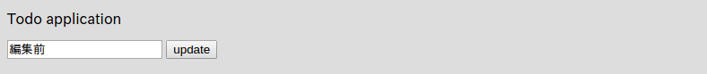
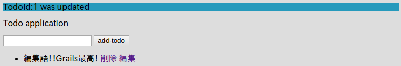
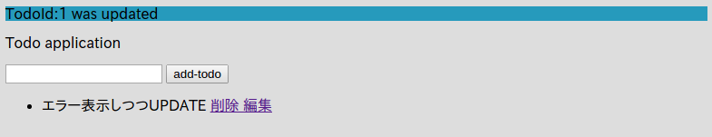

# データの編集

メモ：ココで学ぶこと
- データバインディング
- validate
- バインディングを利用して、saveとupdateを統一できる。（index.gspとedit.gpsの送信先のアクションの統一）

では、データの編集もしていきましょう。

IndexController(`grails-app/controllers/mytodo/IndexController.groovy`)に２つのアクションメソッド`edit`と`update`を追加します。

```groovy
package mytodo

class IndexController {

    def index() {
        render(view:'/index/index', model:[todos : Todo.listOrderById()])
    }

    def formTest() {
        String todoName = params.todo
        render todoName
    }

    def save() {
        String todoName = params.todo
        Todo newTodo = new Todo(todoName: todoName)
        if (newTodo.validate()) {
            newTodo.save()
            redirect(controller: "index", action: "index")
        } else {
            render(view:'/index/index', model:[errorTodo: newTodo, todos: Todo.listOrderById()])
        }
    }

    def delete() {
        Todo todo = Todo.get(params.long("id"))
        // 渡された"id"Todoがちゃんとある場合
        if (todo) {
            todo.delete()
            flash.message = "deleted"
        } else {
            flash.error = "TodoId:${params.long("id")} is not found"
        }
        redirect (controller: "index", action: "index")
    }
    
    // 追加1/2
    def edit(Todo todo) {
        if (todo) {
            render(view: '/index/edit', model:[todo:todo])
        } else {
            flash.error = "TodoId:${params.long("id")} is not found"
            redirect (controller: "index", action: "index")
        }
    }
    // 追加 2/2
    def update(Todo todo) {
        if (todo && todo.validate()) {
            todo.save()
            flash.message = "TodoId:${todo.id} was updated"
            redirect(controller: "index", view: "index")
        } else {
            if (!todo) {
                flash.error = "Todo is not found"
                redirect(controller:"index", action: "index")
            } else {
                flash.error = "validation error"
                render(view: '/index/edit', model:[todo:todo])
            }
        }
    }
}

```
注目すべき点は、アクションメソッドの引数に`Todo todo`を指定している点ですね。  
こうすることで、GrailsはGET、もしくはPOSTで取得できるデータのから自動的にアクションメソッドに指定した型のインスタンスを生成して値を突っ込んでくれます。  

そして対応するテンプレートの`grails-app/views/index/edit.gsp`を作成します。

```html
<!DOCTYPE html>
<html>
<head>
    <meta name="layout" content="my-layout"/>
    <meta charset="UTF-8">
    <title>ToDo</title>
</head>
<body>
<g:if test="${flash.message}">
    <div style="background-color: #269abc">${flash.message}</div>
</g:if>
<g:if test="${flash.error}">
    <div style="background-color: #db7093">${flash.error}</div>
</g:if>
<p>Todo application</p>
<!-- エラーメッセージを表示する部分 -->
<g:renderErrors bean="${todo}" as="list" field="todoName"/>

<g:form controller="index" action="update">
    <g:hiddenField name="id" value="${todo.id}" />
    <g:textField name="todoName" value="${todo.todoName}"/>
    <g:submitButton name="update">update</g:submitButton>
</g:form>
</ul>
</body>
</html>
```

さらに、トップページの各Todoに編集リンクを付けます。  
`grails-app/views/index/index.gsp`

```html
<g:each in="${todos}" var="todo">
    <li>
        ${todo.todoName}
        <g:link controller="index" action="delete" params="['id':todo.id]">
            削除
        </g:link>
        <!-- コレを追加 -->
        <g:link controller="index" action="edit" params="['id':todo.id]">
            編集
        </g:link>
    </li>
</g:each>
```

これで完了です！  
[http://localhost:8080/index/index](http://localhost:8080/index/index)にアクセスして適当なTodoを作ってみましょう。  


編集リンクが追加されていますね！  
では、編集リンクをクリックしてみましょう。  



編集画面が表示されますね。  
では、適当に修正して、updateをクリックしてみてください。  



ちゃんと保存されました！  
コレでWEBアプリケーションフレームワークで最も重要なCRUDの一連の流れをマスターすることが出来ました！  
ちゃんとバリデーションチェックもしているので、エラーメッセージを表示できています。


URLが/index/updateのままになっていますね。
そして重要な点として、先ほどeditした際の情報（入力したテキスト（今回はからのデータ）と、TodoのID（hiddenフィールド）の値もこのエラー画面に表示しているので、このエラーが出ている状態でちゃんと値を修正して、再度updateをクリックすればちゃんと値が更新される点です。  



更新出来ました！

さて、今回のデータバインディング機能を利用すると、実はTodoの新規登録（saveアクションメソッド）と今回の更新（updateアクションメソッド）を統一することが出来ます！  

今回は、updateメソッドとsaveメソッドを統一して`save`メソッドとしましょう。  
。。。といっても実はもうメソッド自体はできているので、単純に`save`アクションメソッドを削除して、今回作成した`update`アクションメソッドを、`save`にリネームするだけです。  
ちなみに、このアクションメソッド自体にルールはありません。単純にCREATEとUPDATEを同時に担うメソッド名なら、saveという名前がピッタリなので私がそうしただけです。（Scaffoldもこのネーミングです。）  
なので、別に`hoge`という名前でも構いません。  

最終的に`IndexController(`grails-app/controllers/mytodo/IndexController.groovy`)は以下のようになります。  

```groovy
package mytodo

class IndexController {

    def index() {
        render(view:'/index/index', model:[todos : Todo.listOrderById()])
    }

    def formTest() {
        String todoName = params.todo
        render todoName
    }

    // saveアクションメソッドは削除した。

    def delete() {
        Todo todo = Todo.get(params.long("id"))
        // 渡された"id"Todoがちゃんとある場合
        if (todo) {
            todo.delete()
            flash.message = "deleted"
        } else {
            flash.error = "TodoId:${params.long("id")} is not found"
        }
        redirect (controller: "index", action: "index")
    }

    def edit(Todo todo) {
        if (todo) {
            render(view: '/index/edit', model:[todo:todo])
        } else {
            flash.error = "TodoId:${params.long("id")} is not found"
            redirect (controller: "index", action: "index")
        }
    }

    // updateからsaveにリネーム
    // 新規作成時も、更新時もこのアクションメソッドを利用する。
    def save(Todo todo) {
        if (todo && todo.validate()) {
            todo.save()
            flash.message = "TodoId:${todo.id} was updated"
            redirect(controller: "index", view: "index")
        } else {
            if (!todo) {
                flash.error = "Todo is not found"
                redirect(controller:"index", action: "index")
            } else {
                flash.error = "validation error"
                render(view: '/index/edit', model:[todo:todo])
            }
        }
    }
}
```

そして、`grails-app/views/index/index.gsp`のフォームの部分を以下のように編集します。  

```html
<g:form controller="index" action="save">
    <!-- nameをtodoNameに修正 -->
    <g:textField name="todoName"/>
    <g:submitButton name="add-todo">Add Todo</g:submitButton>
</g:form>
```
この変更で、saveアクションメソッドがTodoを自動的に生成する際に、該当するプロパティ（todoName）に自動的にこの値を代入してくれるようになりました。  
actionは元々saveだったので変更の必要なしです。

`grails-app/views/index/edit.gsp`は単純にactionの指定を`update`からsaveに変更するだけです。  

```html
<g:form controller="index" action="save">
    <g:hiddenField name="id" value="${todo.id}" />
    <g:textField name="todoName" value="${todo.todoName}"/>
    <g:submitButton name="update">update</g:submitButton>
</g:form>
```

コレで完了です。  
実際に色々自分で動かして動作を確認してみてください。  
Grailsが如何に簡単にWEBアプリケーションを作成できるかがこれで分かりますね。


でもGrailsの魅力はコレだけにとどまりません。もっともっと素敵な機能を触ってどんどん自分のスキルを洗練させていきましょう！