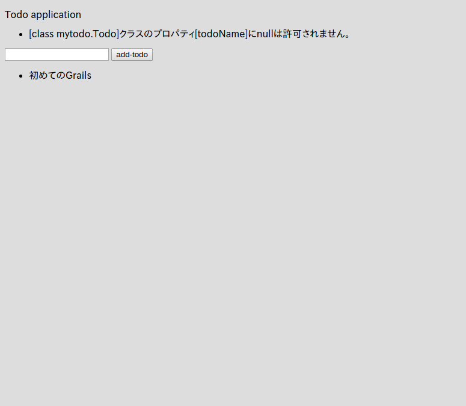

# フォームのデータを保存

では、実際にフォームでデータを送信して、そのデータをデータベースに保存するようにしてみましょう
と言っても本当に簡単です。

まず、フォームからデータを受け取って保存する部分をController 'controllers/mytodo/IndexController.groovy' に記述します。

```groovy
package mytodo

class IndexController {

    def index() {
        render(view:'/index/index', model:[todos : Todo.listOrderById()])
    }

    def formTest() {
        String todoName = params.todo
        render todoName
    }

    // ココを追加。ここでフォームのデータを受け取ってデータベースに保存している。
    def save() {
        String todoName = params.todo
        Todo newTodo = new Todo(todoName: todoName)
        if (newTodo.validate()) {
            newTodo.save()
            redirect(controller: "index", action: "index")
        } else {
            render(view:'/index/index', model:[errorTodo: newTodo, todos: Todo.listOrderById()])
        }
    }
}

```

そして `grails-app/views/index/index.gsp` も少し修正します。

```html
<!DOCTYPE html>
<html>
<head>
    <meta charset="UTF-8">
    <title>ToDo</title>
</head>
<body>
<p>Todo application</p>

<!-- エラーメッセージを表示する部分を追加 -->
<g:renderErrors bean="${errorTodo}" as="list" field="todoName"/>

<!--actionを先ほど追加したsaveに変更-->
<g:form controller="index" action="save">
    <g:textField name="todo"/>
    <g:submitButton name="add-todo">Add Todo</g:submitButton>
</g:form>

<!-- 追加 -->
<ul>
<g:each in="${todos}" var="todo">
    <li>${todo.todoName}</li>
</g:each>
</ul>
</body>
</html>
```

コレで完了です！  
では[http://localhost:8080/index/index](http://localhost:8080/index/index)にアクセスして、何か入力して「add-todo」をクリックしてみましょう。


登録出来ました！  
ところで、普通に考えて何も入力せずに「add-todo」をクリックするとエラーになるべきですよね？  
では、何も入力せずに「add-todo」をクリックして試してみましょう！



なんと！ちゃんとエラーが表示されましたね！  
このエラーメッセージはGrailsが用意してくれているもので、さらにi18n機能と連携しているので、ブラウザの言語設定によってメッセージが自動的に最適な言語に切り替わります。  
コレでToDoを保存する最低限の機能が実装できました。  
