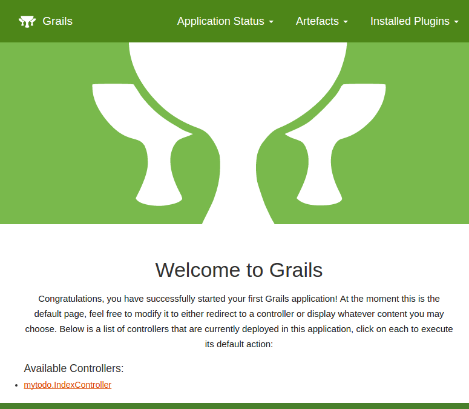
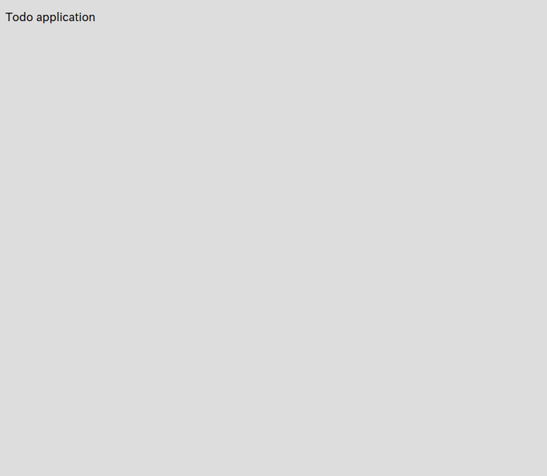

# 準備


では実際にGrailsアプリケーションを作成していきましょう。
アプリケーション名は`mytodo`とします。

```console
[koji:IdeaProjects]$ grails create-app mytodo
Resolving dependencies..
| Application created at /home/koji/IdeaProjects/mytodo
[koji:IdeaProjects]$ cd mytodo 
[koji:mytodo]$ 
```

アプリケーションが作成できたので`grails`コマンドを使ってインタラクティブモードに入ります。

```console
[koji:mytodo]$ grails
```

以降の作業は、特に明示しない限り全てこのインタラクティブモードでの作業になります。

それでは、コントローラを作成します。コントローラ名は`index`です。
以下のコマンドを実行してコントローラを作成します。

```console
grails> create-controller index
```

すると、以下の2つのファイルが作成されます。

```
grails-app/controllers/mytodo/IndexController.groovy
src/test/groovy/mytodo/IndexControllerSpec.groovy
```

最初のファイルが実際のコントローラで、次のファイルがそのテスト用のファイルになります。  
テストについてはチュートリアルの最後で別途説明します。  
では、次にテンプレート（View）を作成します。  
コチラは作成用のコマンドは用意されていないので、普通にテキストファイルとして作成します。  
以下のファイルを作成してください。  
`grails-app/views/index/index.gsp`

ファイルの中身はとりあえず以下のようにしましょう。

```html
<!DOCTYPE html>
<html>
<head>
    <meta charset="UTF-8">
    <title>ToDo</title>
</head>
<body>
<p>Todo application</p>
</body>
</html>
```

コレで事前準備は完了です。
Grailsを起動しましょう。

```console
grails> run-app
```

*初めてGrailsを起動するときはライブラリなどがダウンロードされたりするので少し時間がかかります。*

最終的に

```
Grails application running at http://localhost:8080 in environment: development
```

と表示されればOKです！
では[http://localhost:8080](http://localhost:8080)にアクセスしてみましょう。



次に、自分で作成したControllerとViewにアクセスしてみましょう！！  
URLは[http://localhost:8080/index/index](http://localhost:8080/index/index)

  

これで基本的な準備は完了しました！