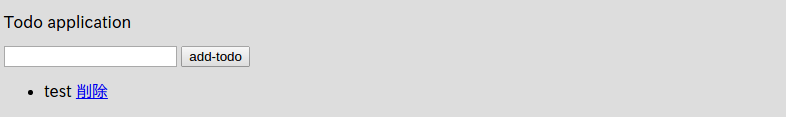
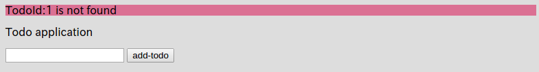

# データの削除

メモ：ココで学ぶこと
- ドメインの削除
- flashスコープ
- paramsの概要
- g:linkでパラメータを渡す方法
- GrailsのURLのシンプルな概要（ついでにidというパラメタがある場合は省略されて/数字という値になることも説明


データを登録できるようになったので、データの削除機能も作っていきましょう

以下のように、Indexコントローラ（`grails-app/controllers/mytodo/IndexController.groovy`）に`delete`というアクションを追加しましょう。  

```groovy
package mytodo

class IndexController {

    def index() {
        render(view:'/index/index', model:[todos : Todo.listOrderById()])
    }

    def formTest() {
        String todoName = params.todo
        render todoName
    }

    def save() {
        String todoName = params.todo
        Todo newTodo = new Todo(todoName: todoName)
        if (newTodo.validate()) {
            newTodo.save()
            redirect(controller: "index", action: "index")
        } else {
            render(view:'/index/index', model:[errorTodo: newTodo, todos: Todo.listOrderById()])
        }
    }

    // コレを追加
    def delete() {
        Todo todo = Todo.get(params.long("id"))
        // 渡された"id"Todoがちゃんとある場合
        if (todo) {
            todo.delete()
            flash.message = "deleted"
        } else {
            flash.error = "TodoId:${params.long("id")} is not found"
        }
        redirect (controller: "index", action: "index")
    }
}
```

次に、テンプレート(`grails-app/views/index/index.gsp`)に、Todoの一覧を表示している部分に削除のためのリンクを付けましょう。

```html
<!DOCTYPE html>
<html>
<head>
    <meta name="layout" content="my-layout"/>
    <meta charset="UTF-8">
    <title>ToDo</title>
</head>
<body>

<!-- メッセージ表示を追加-->
<g:if test="${flash.message}">
    <div style="background-color: #269abc">${flash.message}</div>
</g:if>
<g:if test="${flash.error}">
    <div style="background-color: #db7093">${flash.error}</div>
</g:if>

<p>Todo application</p>
<!-- エラーメッセージを表示する部分 -->
<g:renderErrors bean="${errorTodo}" as="list" field="todoName"/>

<g:form controller="index" action="save">
    <g:textField name="todo"/>
    <g:submitButton name="add-todo">Add Todo</g:submitButton>
</g:form>

<ul>
<g:each in="${todos}" var="todo">
    <!-- この部分を修正。削除用リンク（追加したdeleteアクションへのリンク）を追加 -->
    <li>
        ${todo.todoName}
        <g:link controller="index" action="delete" params="['id':todo.id]">
            削除
        </g:link>
    </li>
</g:each>
</ul>
</body>
</html>
```

はい！これで完了です！  
既にTodoが何かある状態でアクセスすると以下のような画面が表示されます。  
[http://localhost:8080/index/index](http://localhost:8080/index/index)にアクセスしてみましょう。




今回新しく出てきたgsp専用タグが２つ有ります。  
まず一つ目が`g:if`ですね。  
その名のとおり、変数の状態を確認します。`test="${Groovy式}"`を指定することで、変数の指定されたGroovy式がtrueを返せば`g:if`タグの中身を表示します。  
なお、今回は２つの独立した`g:if`を使って、それぞれ`flash.message`と`flash.error`という２つの変数の中身があるかどうかをチェックしています。  
そして２つ目の新しいタグが`g:link`です。コレは単純にHTMLのaタグを出力するものです。  
便利な点として、リンクに渡すクエリストリングを、GroovyのMapで記述することが出来る点です。  
`params="['id':todo.id]`がそうです。  
実際にこの`a:link`で出力されたHTMLは以下のようになります。  

```html
<a href="/index/delete/1">
  削除
</a>
```

単純HTMLですね。  
当然上記のHTMLをGSP内に直接`<a href="/index/delete/${todo.id}">削除</a>`と記述しても全く問題ありません。  
状況に応じて使い分けましょう。（個人的には`g:link`を使うほうがオススメですが。）  

それでは、何か適当にTodoを登録して、その横に表示されている「削除」をクリックしてみてください。


削除出来ましたね！
さら青い背景でメッセージもちゃんと出ていますね。コレは`flash.message`を使いました。  
flashスコープはその１リクエストのみ有効なので、この画面をリフレッシュすると、`flash.message`は空っぽになって、このメッセージは表示されなくなります。  
このように一回コッキリのメッセージを表示するのに非常に便利です。  
では、既に存在しないTodoを削除してみましょう  
[http://localhost:8080/index/delete/1](http://localhost:8080/index/delete/1)にアクセスしてみてください。



ちゃんと赤い背景でエラーメッセージが出力されましたね！  
コレも同様にflashスコープの`flash.error`を使用してエラーメッセージを表示しています。  
これもflashスコープなので、画面を更新すれば`flash.error`の中身が自動的に空っぽになってメッセージは表示されないことが確認できます。  