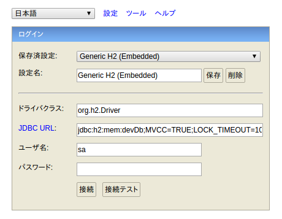
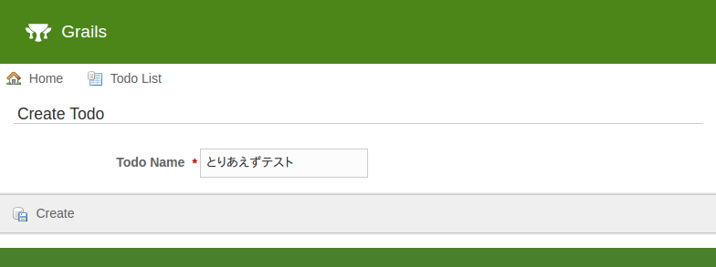
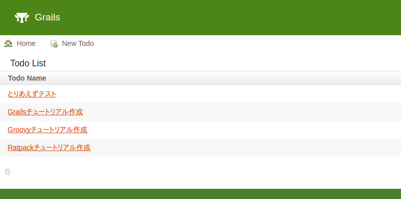
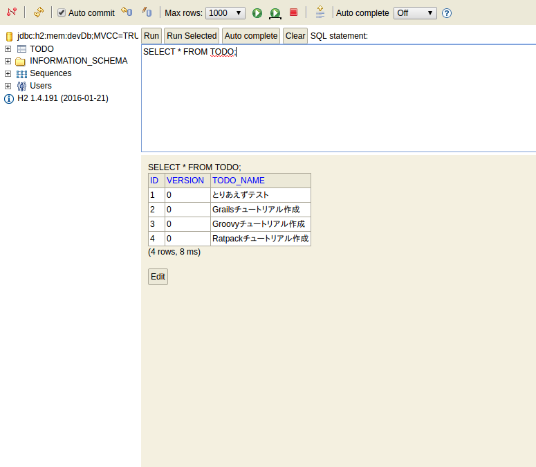
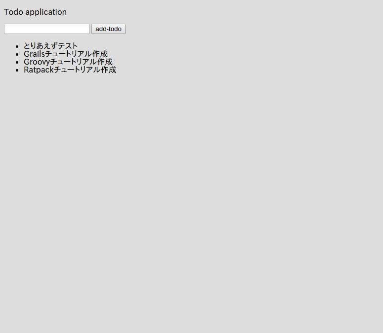

# データを保存する

さて、フォームのデータをアプリケーションサーバ（Grails）に送信することが出来ました。  
そうなるとやぱりこのデータをデータベースに保存したくなりますよね。  
Grailsでは、 **標準でH2Databaseが搭載されていて、別途DBをインストールする必要はありません。**  

標準の設定だと、Grailsが終了（stop-appした段階）で、データベースは破棄されます。  
不思議に思われるかも知れませんが、コレはGrailsの学習段階、そして新規にアプリケーションを立ち上げる際にその威力を発揮してくれます。  
というのも、標準設定だとGrailsを起動した時点（run-app）で、自動的にデータベース、そしてテーブルがGrailsによって作成されます。  
詳細は別途記述しますので、ココではコレ以上細かい話は気にせず、とりあえずGrailsの素晴らしさを体験してみましょう！

まず、インタラクティブモードで以下のコマンドを実行してください。

```console
grails> create-domain-class todo
```

すると以下の２つのファイルが作成されます。

```
grails-app/domain/mytodo/Todo.groovy
src/test/groovy/mytodo/TodoSpec.groovy
```

Controllerの時と同様、２つ目がテスト用です。  
そして、最初に作製されている`Todo.groovy`が **ドメイン** と呼ばれるもので、MVCでいうM（Model）に該当します。  
Grailsでは、このドメインがGORM（Grails Object Relational Mapping)というORMを通して、データベースのテーブルと関連付けられます。  

では、作成された`grails-app/domain/mytodo/Todo.groovy`を開いてみましょう。  

```groovy
package mytodo

class Todo {

    static constraints = {
    }
}

```

何の変哲もないGroovyファイルですね。
では、以下のように一つプロパティを追加してみます。

```groovy
package mytodo

class Todo {
    
    String todoName

    static constraints = {
    }
}
```

さて、それでは **一旦Grailsを再起動してください。**
Grailsでは、ドメインを編集すると、一旦Grailsを再起動しないと上手く反映されません。  
面倒くさい、と思われるかも知れませんが、その面倒臭さを超える利便性をこれから目の当たりにします！  

```
grails> stop-app
grails> run-app
```

再起動できたら[http://localhost:8080/dbconsole](http://localhost:8080/dbconsole)にアクセスしてみてください。



コレはGrailsが用意してくれているH2データベース用のWEBクライアントです。  
基本的にデフォルトの設定のままでOKのはずです。  
もしアクセスできない場合は、 **JDBC URL:** の部分が`jdbc:h2:mem:devDb;MVCC=TRUE;LOCK_TIMEOUT=10000;DB_CLOSE_ON_EXIT=FALSE`になっているか確認してください。  
では、「接続」をクリックしてみてください。  


左上を見てください！ **何もしていないのに既にTODOテーブルが存在しています！**  
別途SQLを書く必要もなく、さらに手動でマイグレーションツール等を毎回手動で実行する必要もありません！  
もちろん本番環境用にマイグレーションツールなども用意されています。その当たりはまた別の章で記載します。  

しかしGrailsの生産性の高さはコレだにとどまりません。  
続いて、インタラクティブコンソールで以下のコマンドを実行してみてください。

# Scaffold

```console
grails> create-scaffold-controller todo
```

すると、`grails-app/controllers/mytodo/TodoController.groovy`というファイルが生成されます。  
つまり、新しい`Todo`というControllerが作成されたということですね。
中身を見てみましょう。

```groovy
package mytodo

class TodoController {

    static scaffold = Todo

}
```

１行だけ`static scaffold = Todo`という記述があるだけでActionは定義されていません。  
では、このコントローラにアクセスしてみましょう。  
[http://localhost:8080/todo](http://localhost:8080/todo) 


なんと！先ほどの１行のみのControllerにアクセスするとCRUD機能が利用できるようになっています！  
コレがGrailsのScaffoldです。

では実際に「New Todo」をクリックしてデータを保存してみてください。  
（ブラウザの言語設定によって、自動的にメニューが翻訳されます！これもGrailsの素晴らしいi18n機能によるものです。）  



saveをクリックすると...


保存されました！  
当然この画面でデータの編集、削除も出来ます。  
適当に数件データを登録したりしてみましょう。  


最終的に以下のようにデータを登録しました。



再度[http://localhost:8080/dbconsole](http://localhost:8080/dbconsole)にアクセスして、todoテーブルの中身を見てみるとちゃんとデータベースにデータが保存されていることが確認できます！



# 保存したデータの表示
では、今度はこの保存したデータを実際にGrailsで表示してみましょう！

まず、`grails-app/controllers/mytodo/IndexController.groovy`の`index`アクションを以下のように修正します。  

```groovy
package mytodo

class IndexController {

    def index() {
        render(view:'/index/index', model: [todos : Todo.listOrderById()])
    }

    def formTest() {
        String todoName = params.todo
        render todoName
    }
}
```

そして、View用のファイル、`grails-app/views/index/index.gsp`を以下のように修正します。 　

```html
<!DOCTYPE html>
<html>
<head>
    <meta charset="UTF-8">
    <title>ToDo</title>
</head>
<body>
<p>Todo application</p>
<g:form controller="index" action="formTest">
    <g:textField name="todo"/>
    <g:submitButton name="add-todo">Add Todo</g:submitButton>
</g:form>

<!-- 追加 -->
<ul>
<g:each in="${todos}" var="todo">
    <li>${todo.todoName}</li>
</g:each>
</ul>
</body>
</html>
```

では、[http://localhost:8080/index/index](http://localhost:8080/index/index)にアクセスしてください。 　



先ほどScaffoldで登録したToDoの一覧が表示されていますね！